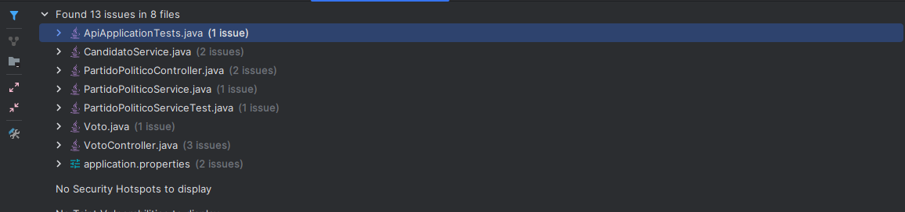
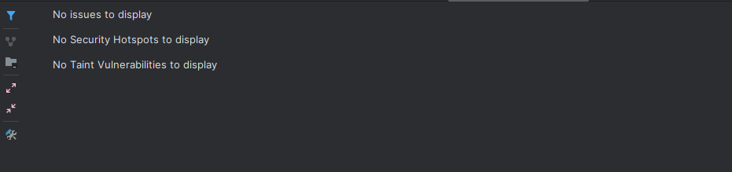

# Sistema de Votaciones (Spring Boot)

Proyecto hecho con Spring Boot y Java 21 para gestionar partidos políticos, candidatos y el registro de votos. La idea es practicar controllers, servicios, validaciones y persistencia con H2 en memoria.

## ¿Cómo ejecutar el proyecto?

Requisitos:

- Java 21
- Maven (o usar los wrappers `mvnw` / `mvnw.cmd`)

Pasos rápidos:

1. Clona el repo y entra al módulo `api`.
2. (Opcional) Define variables de entorno si quieres usuario/clave en H2:
   - `DB_USERNAME` y `DB_PASSWORD` (si no las pones, H2 igual levanta en memoria)
3. Ejecuta la aplicación:
   `mvn spring-boot:run`
4. La app arranca en `http://localhost:8080`.

Endpoints útiles:

- Swagger UI: `http://localhost:8080/swagger-ui.html`
- API Docs (OpenAPI): `http://localhost:8080/api-docs`
- Consola H2: `http://localhost:8080/h2-console`  
  JDBC URL: `jdbc:h2:mem:votaciones`

## Datos de prueba (paso a paso)


1. Crear un partido

```http
POST /api/partidos
Content-Type: application/json

{
  "nombre": "Partido de Prueba",
  "sigla": "PDP"
}
```

Respuesta esperada: 201 Created con el partido creado (incluye `id`).

2. Crear un candidato (usa el `id` del partido creado)

```http
POST /api/candidatos
Content-Type: application/json

{
  "nombreCompleto": "Juan Pérez",
  "partidoId": 1
}
```

Respuesta esperada: 201 Created con el candidato creado.

3. Registrar un voto (usa el `id` del candidato creado)

```http
POST /api/votos
Content-Type: application/json

{
  "candidatoId": 1
}
```

Respuesta esperada: 201 Created con el voto registrado.

4. Consultar listados y conteos

```http
GET /api/partidos
GET /api/partidos/1
GET /api/partidos/1/votos

GET /api/candidatos
GET /api/candidatos/1
GET /api/candidatos/1/votos
```

## Colección Postman

Podes importar el archivo `Votaciones API.postman_collection` en Postman para probar todos los endpoints de la API de manera fácil.

## Captura de análisis SonarLint antes



## Captura de análisis SonarLint despues



## Estructura del proyecto

```
src/main/java/com/evaluacion_dos/api/
├── controller/     # Controladores REST
├── service/        # Lógica de negocio
├── repository/     # Acceso a datos
├── model/          # Entidades JPA
├── dto/           # Objetos de transferencia
└── exception/     # Manejo de excepciones
```

## Autor

Desrrollado por Lautaro Espinillo para la evaluacion N°2 de Moby Digital PreAcademy
